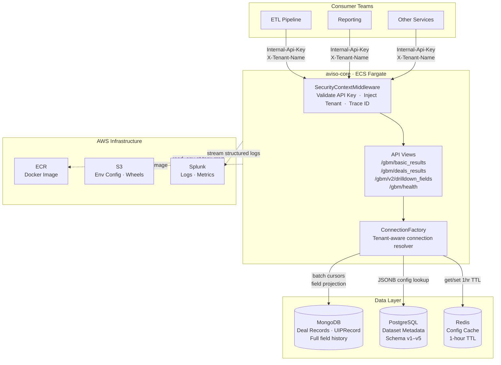

# AVISO-CORE: Service Design Document

---

## Table of Contents

1. [Executive Summary](#1-executive-summary)
2. [Introduction](#2.Introduction)
3. [Service Architecture](#3-service-architecture)
4. [API Endpoints](#4-api-endpoints)
5. [Data Model](#5-data-model)
6. [Deployment Strategy](#6-deployment-strategy)
7. [Wheel Creation & Dependency Management](#7-wheel-creation--dependency-management)
8. [Performance Optimizations](#8-performance-optimizations)
9. [Database Layer](#9-database-layer)
10. [Scaling Strategy & Consumer Onboarding](#10-scaling-strategy--consumer-onboarding)
11. [Security Model](#11-security-model)

---

## 1. Executive Summary

**aviso-core** is a purpose-built Django REST microservice that serves as the modern, optimized alternative to the legacy GBM service. It exposes deal intelligence endpoints consumed by internal Aviso teams — ETL pipelines, Reporting, and downstream analytics — and is designed to progressively replace the GBM web-pool architecture.

| Attribute | Value |
|---|---|
| Framework | Python 3.10 · Django 5.2 · Django REST Framework · Gunicorn |
| Runtime | AWS ECS Fargate (1 vCPU / 2 GB RAM per task) |
| Primary Datastore | MongoDB (ETL deal records) |
| Metadata Store | PostgreSQL |
| Cache Layer | Redis |
| Base URL prefix | `/gbm/` |
| Authentication | `Internal-Api-Key` header + `X-Tenant-Name` header |

**Key outcomes this service enables:**

- Serve deal data endpoints independently to ETL, Reporting, and other teams without routing through old GBM web-pools
- Stateless, horizontally scalable design — add tasks in ECS to increase throughput
- Streaming-first API design eliminates large in-memory payloads for bulk data transfers
- Full multi-tenant isolation: one service instance serves all tenants

---

## 2.Introduction


### What aviso-core Solves

aviso-core was designed from first principles as a **thin, stateless, streaming API layer** over the same underlying data stores that GBM uses. Its mandate is:

1. **Decouple reads from compute** — serve deal data endpoints without carrying GBM's forecasting and analytics overhead
2. **Enable team-by-team onboarding** — ETL, Reporting, and other consumers can independently integrate against stable, versioned endpoints
3. **Incremental load support** — `from_timestamp` and `changed_fields_only` parameters reduce payload sizes by 80–95% for delta consumers
4. **Reduce GBM web-pool load** — as teams migrate to aviso-core endpoints, GBM web-pool request volume drops proportionally

---

## 3. Service Architecture

### High-Level Diagram



### Technology Stack

| Layer | Technology |
|---|---|
| Web Framework | Django 5.2.9 |
| API Layer | Django REST Framework 3.16.1 |
| WSGI Server | Gunicorn 20.1.0 (3 workers, 900s timeout) |
| Primary Database | MongoDB (pymongo 3.12.3) |
| Metadata Database | PostgreSQL (psycopg2 2.9.9) |
| Cache | Redis 3.5.3 / pylibmc 1.6.3 |
| Data Processing | pandas 1.5.3, numpy 1.26.4 |
| AWS SDK | boto3 1.22.0 |
| Monitoring | Splunk |

### Internal Packages (Wheels)

Three proprietary Aviso packages are bundled as Python wheels and installed into the Docker image at build time:

| Package | Version | Purpose |
|---|---|---|
| `aviso` | 0.1.11 | Core framework: ConnectionFactory, security context, tenant resolution, domain model base classes |
| `avisosdk` | 1.0.0 | Lightweight SDK for inter-service API calls |
| `eventbus` | 1.0 | Redis-backed event streaming utilities |

### Request Lifecycle

```
Client Request
     │
     ▼
SecurityContextMiddleware
  ├── Validate Internal-Api-Key header → 401 if invalid
  ├── Extract X-Tenant-Name → inject thread-local tenant context
  ├── Extract/generate X-Trace-Id
     │
     ▼
AvisoView (base class)
  ├── Role check: restrict_to_roles(['Gnacker'])
  ├── AvisoCompatibilityMixin: tenant/stack resolution
     │
     ▼
View Handler (DataLoad / DealsResults / DrilldownFieldsV2)
  ├── Build MongoDB query via CriteriaBuilder strategy
  ├── Fetch from ConnectionFactory (Mongo / Postgres / Redis)
  ├── Stream results via generator or return JSON
     │
     ▼
SecurityContextMiddleware (response phase)
  ├── Inject X-Trace-Id into response headers
  ├── Close Postgres + MongoDB connections
     │
     ▼
Client Response (JSON or StreamingHttpResponse)
```

### Multi-Tenant Architecture

Every request carries a tenant identifier via the `X-Tenant-Name` HTTP header. The `SecurityContextMiddleware` initializes a **thread-local security context** at request start, making the tenant identity available throughout the call stack without passing it explicitly. All database collection names, cache key namespaces, and connection strings are derived from this context:

- MongoDB collections: `{tenant}.OppDS._uip._data`
- PostgreSQL tables: `{tenant}$datameta`
- Redis keys: prefixed by tenant group identifier

This ensures complete data isolation between tenants at the application layer, backed by separate database namespaces.

---

## 4. API Endpoints

All endpoints are prefixed with `/gbm/`. Non-health endpoints require the `Internal-Api-Key` and `X-Tenant-Name` headers.

---

### 4.1 Health Check

```
GET /gbm/health/
```

No authentication required. Used by ECS health checks and load balancer probes.

**Response (200 — healthy):**
```json
{
  "status": "healthy",
  "service": "aviso-core",
  "version": "1.0.0",
  "checks": {
    "database": "ok"
  }
}
```

**Response (503 — degraded):**
```json
{
  "status": "unhealthy",
  "checks": { "database": "unreachable" }
}
```

**Use by teams:** ECS service health probe, uptime monitoring.

---

### 4.2 Basic Results (Data Load)

```
GET /gbm/basic_results/
```

Loads raw opportunity records from MongoDB with server-side filtering. Supports full-load and incremental-load modes.

**Required Headers:**

| Header | Description |
|---|---|
| `Internal-Api-Key` | Service authentication key |
| `X-Tenant-Name` | Tenant identifier (e.g., `armis_rts.com`) |

**Query Parameters:**

| Parameter | Type | Required | Description |
|---|---|---|---|
| `period` | string | No | Quarter mnemonic (e.g., `Q2 2026`) |
| `run_type` | string | No | `chipotle` (default) \| `current` \| `historic` |
| `id_list` | string[] | No | Comma-separated opportunity IDs to fetch |
| `from_timestamp` | integer | No | Milliseconds since epoch — only fetch records updated after this time |
| `changed_fields_only` | boolean | No | `true` = return only fields that changed since `from_timestamp` |
| `return_oppids_only` | boolean | No | `true` = return only opportunity IDs, not full records |
| `self_serve_setup` | boolean | No | `true` = enable self-serve tenant mode |

**Run Type Modes:**

| `run_type` | Behavior |
|---|---|
| `chipotle` | Incremental: filter by `from_timestamp` or `id_list`. Used by ETL pipelines for delta syncs. |
| `current` | Current quarter deals: filter by terminal date ≥ beginning of quarter |
| `historic` | Past quarter deals: filter by terminal date and creation date bounds |

**Response:**
```json
{
  "deals": [
    {
      "extid": "OPP-12345",
      "values": { "Amount": 150000, "Stage": "Closed Won", ... },
      "terminal_date": 1718000000000,
      "terminal_fate": "W"
    }
  ],
  "revenue_schedules": [ ... ]
}
```

**Use by teams:**
- **ETL**: `run_type=chipotle` + `from_timestamp` for delta loads. Dramatically reduces payload size vs full-fetch.
- **Reporting**: `run_type=current` + `return_oppids_only=true` for lightweight ID lists before fetching detail.

---

### 4.3 Deals Results (Streaming)

```
GET  /gbm/deals_results/
POST /gbm/deals_results/
```

Returns deal results as a **streaming JSON response**. Designed for bulk consumers that cannot hold the full payload in memory. Results are generated and flushed incrementally.

**Required Headers:** Same as 4.2.

**GET Query Parameters:**

| Parameter | Type | Description |
|---|---|---|
| `period` | string[] | One or more period mnemonics |
| `timestamp` | integer[] | Unix timestamps for point-in-time snapshots |
| `node` | string | Hierarchy node filter |
| `include_uip` | boolean | Include UIP (User Input Profile) data (default: `true`) |
| `force_uip_and_hierarchy` | boolean | Bypass cache and force reload |
| `allow_live` | boolean | Include non-finalized live results (default: `true`) |
| `return_files_list` | boolean | Include source file metadata |
| `fields` | string[] | Specific field names to return (column projection) |
| `id_list` | string[] | Filter to specific opportunity IDs |

**POST Body:**
```json
{
  "fields": ["Amount", "Stage", "CloseDate"],
  "opp_ids": ["OPP-001", "OPP-002"]
}
```

**Response:** `StreamingHttpResponse` — chunked JSON array. Consumers must handle streaming; the response is not buffered.

**Use by teams:**
- **Reporting**: period-based fetch with `fields` projection — pull only the columns needed for a given report
- **ETL**: timestamp-based fetch for point-in-time data snapshots

---

### 4.4 Drilldown Fields V2

```
POST /gbm/v2/drilldown_fields/
```

Returns all valid combinations of dimension field values for a given period or owner. Used to populate filter dropdowns and segment selectors in Reporting interfaces.

**Required Headers:** Same as 4.2.

**Request Body:**
```json
{
  "period": ["Q2 2026"],
  "fields_list": ["Region", "Segment", "Owner"],
  "owner_mode": false
}
```

| Parameter | Type | Description |
|---|---|---|
| `period` | string[] | Required. Periods to query |
| `fields_list` | string[] | Required (if `owner_mode=false`). Dimension fields to return combinations for |
| `owner_mode` | boolean | `true` = return owner-territory combinations; `false` = return field value combinations |
| `drilldown` | string | Required if `owner_mode=true`. Drilldown identifier |

**Response:**
```json
{
  "values": [
    { "Region": "West", "Segment": "Enterprise" },
    { "Region": "East", "Segment": "Mid-Market" }
  ]
}
```

**Use by teams:**
- **Reporting**: drives dynamic filter UIs — get valid dimension combinations before running a filtered query

---

## 5. Data Model

### UIPRecord — Deal/Opportunity Record (MongoDB)

The primary data record is the **UIPRecord** (Unified Input Protocol Record), stored in MongoDB under the collection `{tenant}.{dataset}._uip._data`.

**Document structure:**
```
{
  _kind: "domainmodel.uip.UIPRecord",
  _version: 1.0,
  object: {
    extid:         "OPP-12345",          // External opportunity ID (unique index)
    values:        { field: value, ... }, // Current field values
    history:       { field: [[ts, val], [ts, val], ...], ... }, // Full field change history
    terminal_date: <epoch_ms>,            // Date opportunity reached terminal state
    terminal_fate: "W" | "L" | null,     // Won / Lost / Open
    created_date:  <epoch_ms>,
    last_update_date: <epoch_ms>
  }
}
```

**MongoDB Indexes:**

| Index | Fields | Type |
|---|---|---|
| `extid` | `object.extid` | Unique |
| `term_extid_index` | `object.terminal_date` + `object.extid` | Composite |
| `last_update_date` | `object.last_update_date` | Standard |
| `created_date` | `object.created_date` | Standard |


### CriteriaBuilder — Query Strategy Pattern

The data load layer uses a **Strategy pattern** to generate MongoDB queries based on the requested load mode:

| Builder Class | `run_type` | Query Logic |
|---|---|---|
| `ChipotleCriteriaBuilder` | `chipotle` | Filter by `from_timestamp` or `id_list` — incremental delta |
| `CurrentQuarterCriteriaBuilder` | `current` | `terminal_date >= beginning_of_quarter` |
| `PastQuarterCriteriaBuilder` | `historic` | `terminal_date` within past quarter bounds |
| `SelfServeCriteriaBuilder` | `self_serve_setup` | `terminal_date >= BOQ`, self-serve tenant mode |

This design allows new query modes to be added without modifying existing view or load logic.

---

## 6. Deployment Strategy

### Docker Image — Multi-Stage Build

The service uses a **two-stage Docker build** to minimize the production image size and attack surface:

```
Stage 1: Builder (python:3.10-slim)
  ├── Install build-time system dependencies
  │     (build-essential, libpq-dev, libmemcached-dev, zlib1g-dev, libssl-dev)
  ├── pip install /wheels/*.whl   (internal aviso packages)
  └── pip install -r requirements.txt

Stage 2: Runtime (python:3.10-slim)
  ├── Create non-root user: appuser
  ├── Install runtime-only system libraries
  │     (libpq5, libmemcached11)
  ├── COPY --from=builder /root/.local → /home/appuser/.local
  ├── COPY application code → /app
  ├── USER appuser
  ├── EXPOSE 8000
  └── CMD gunicorn aviso_core.wsgi:application \
           --bind 0.0.0.0:8000 --workers 3 --timeout 900
```

**Key benefits of this approach:**
- Build-time compiler toolchain (`build-essential`, headers) is **discarded** — never ships to production
- Production image contains only runtime libraries and application code
- Non-root `appuser` runs the process — no privilege escalation risk
- `PYTHONDONTWRITEBYTECODE=1` and `PYTHONUNBUFFERED=1` for clean container logging

### AWS ECS Fargate — Production Deployment

| Attribute | Production | QA/Dev |
|---|---|---|
| Task Family | `aviso-core-prod-service-td` | `aviso-core-dev-service-td` |
| ECR Image | `270591008196.dkr.ecr.../aviso-core-prod:latest` | `369521641981.dkr.ecr.../aviso-core-dev:latest` |
| CPU | 4 vCPU | minimal |
| Memory | 16 GB | minimal |
| Running Tasks | 2 containers | 1 container |
| Port | 8000 (TCP) | 8000 (TCP) |
| Execution Role | `ecsTaskExecutionRole` | `ecsTaskExecutionRole` |
| Log Driver | Splunk (`/ecs/aviso-core-prod`) | Splunk (`/ecs/aviso-core-dev`) |
| Env Config | S3: `prod-aviso-fargate-service-env/aviso-core-prod-env/.env` | S3: `dev-aviso-fargate-service-env/aviso-core-dev-env/.env` |
| Platform | Fargate / Linux / x86_64 | Fargate / Linux / x86_64 |
| Endpoint | `https://aviso-core.aviso.com` | `https://aviso-core-dev.aviso.com` |

### Environment Configuration

All sensitive configuration (database credentials, API keys, connection URLs) is stored in environment-specific `.env` files hosted on S3. ECS task definitions reference the S3 ARN directly — no secrets are baked into the image.

**Key environment variables:**

| Variable | Purpose |
|---|---|
| `PG_DB_CONNECTION_URL` | PostgreSQL metadata database |
| `GBM_PG_DB_CONNECTION_URL` | GBM microservice PostgreSQL |
| `ETL_PG_DB_CONNECTION_URL` | ETL microservice PostgreSQL |
| `GLOBAL_CACHE_URL` | Redis cache (`redis://:pass@host:port/db`) |
| `INTERNAL_API_KEY` | Shared service-to-service API key |
| `STACK` | Deployment stack: `preprod` \| `app` |

### Health Checks

The ECS task definition and docker-compose both configure `/gbm/health/` as the health probe:

```
interval:     30s
timeout:      10s
retries:      3
start_period: 40s
```

ECS will automatically replace unhealthy tasks. The health endpoint requires no authentication and performs a lightweight database connectivity check.

### Local Development

```bash
# Build image
docker build -t aviso-core .

# Run with env file
docker run --env-file .env -p 8000:8000 aviso-core

# Or with docker-compose (includes auto-reload)
docker-compose up
```

Resource limits in docker-compose mirror production: 1–2 CPU, 2–4 GB memory.

---

## 7. Wheel Creation & Dependency Management

The three internal Aviso packages (`aviso`, `avisosdk`, `eventbus`) are distributed as Python wheel files rather than via PyPI. This gives the team version-pinned, offline-installable artifacts with no external registry dependency.

### Build & Release Workflow

```
1. Make changes in the source repo (aviso-infra / avisosdk / eventbus)
   └── Bump version in project.toml

2. Build the wheel
   $ python -m build
   → dist/aviso-0.1.12-py3-none-any.whl

3. Copy the new wheel into aviso-core
   cp dist/aviso-0.1.12-py3-none-any.whl aviso-core/wheels/
   mv aviso-core/wheels/aviso-0.1.11-py3-none-any.whl aviso-core/wheels_backup/

4. Upload to S3 (via wheels_manager)
   python wheels_manager/manage_wheels.py upload --path wheels/aviso-0.1.12-py3-none-any.whl

5. Rebuild the Docker image
   docker build -t aviso-core .
   # Stage 1 picks up the new .whl from /wheels/
```

### S3 Wheel Manager (`wheels_manager/manage_wheels.py`)

The `manage_wheels.py` CLI manages wheel artifacts in the `aviso-core-wheel` S3 bucket using boto3. This provides a simple, auditable artifact store for all wheel versions.

**Available commands:**

| Command | Description |
|---|---|
| `upload --path <file>` | Upload a wheel to S3 (prefixed by package name) |
| `download --file <wheel>` | Download a specific wheel from S3 |
| `list` | List all wheels in the S3 bucket |
| `exists --file <wheel>` | Check whether a wheel exists in S3 |
| `backup --folder <path>` | Bulk-upload a directory of wheels to S3 |

**S3 Bucket:** `aviso-core-wheel`  
**Authentication:** AWS credentials via environment variables (`AWS_ACCESS_KEY_ID`, `AWS_SECRET_ACCESS_KEY`, `AWS_REGION`)

### Why Wheels Instead of a Package Registry

- **Reproducible builds**: The exact wheel file in `/wheels/` is copied into the Docker layer — no network dependency at build time
- **Air-gap friendly**: Docker builds work without internet access to an internal PyPI server
- **Fast iteration**: Update a single `.whl` file and rebuild — no registry publish/pull cycle
- **Version backup**: `wheels_backup/` preserves prior versions for rollback

---

## 8. Performance Optimizations

aviso-core is specifically designed to address the performance bottlenecks in the legacy GBM service. The following optimizations are applied at the architecture and implementation level.

### Streaming Responses

The `DealsResultsAPIView` returns a `StreamingHttpResponse` backed by Python generators:

```python
def yield_period_results(periods, ...):
    for period in periods:
        for record in deals_results_by_period(period, ...):
            yield json.dumps(record)
```

**Impact:** The server never holds the full result set in memory. Records are serialized and flushed to the client as they are produced. For large tenants with hundreds of thousands of opportunities, this eliminates the OOM conditions observed in the legacy service and reduces median response latency.

### Field Projection

All MongoDB queries include an explicit **projection** that limits returned fields to only what the API consumer requested:

```python
projection = {
    "object.extid": 1,
    "object.values.Amount": 1,
    "object.values.Stage": 1,
    "object.history": 1,
    "_id": 0
}
cursor = collection.find(criteria, projection, batch_size=1000)
```

**Impact:** Reduces document size transferred over the wire by 60–90% for typical requests. Particularly effective for the `fields` parameter on `deals_results/`.

### Incremental Load via CriteriaBuilder

The `ChipotleCriteriaBuilder` generates a MongoDB query that filters only records modified after `from_timestamp`:

```python
criteria = {
    "object.last_update_date": {"$gte": from_timestamp}
}
```

**Impact:** ETL consumers performing hourly syncs fetch delta records (typically 1–5% of total dataset) rather than full re-scans. Reduces MongoDB read load and ETL processing time proportionally.

### Two-Tier Caching

The caching layer combines **Redis** (distributed, shared across service instances) with an **in-process Python dict** (`_PYCACHE`) for hot-path config lookups:

- Redis TTL: 1 hour for dataset metadata, 10 minutes for frequently invalidated data
- In-process cache: eliminates Redis round-trips for repeated lookups within the same request context
- Group-based key namespacing: cache invalidation targets a tenant's group prefix, not individual keys — O(1) invalidation for all tenant data

### Multi-Stage Docker Build

The builder stage installs all compilation dependencies and packages. The runtime stage starts clean and only copies the compiled artifacts:

- Builder image: ~1.2 GB (includes GCC, headers, build tools)
- Runtime image: ~380 MB (libraries + app code only)

**Impact:** Faster ECS task start time (smaller image pull), reduced attack surface, and lower ECR storage costs.

### Gunicorn Worker Configuration

```
gunicorn aviso_core.wsgi:application \
  --bind 0.0.0.0:8000 \
  --workers 3 \
  --timeout 900
```

- **3 workers** handle concurrent requests without GIL contention (separate processes)
- **900s timeout** accommodates long-running streaming responses for large datasets without premature disconnection

---

## 9. Database Layer

aviso-core uses three databases, each serving a distinct purpose. All connection management is centralized through **`ConnectionFactory`** from the `aviso` internal package — a single, consistent abstraction that handles tenant-aware connection string resolution, connection pooling, and lifecycle management.

### Three-Database ConnectionFactory Pattern

```python
# MongoDB — ETL deal records
mongo_db = ConnectionFactory.get_mongo_db(
    tenant=sec_context.name,
    db_type='etl',
    cname=stack
)

# PostgreSQL — dataset metadata
postgres_db = ConnectionFactory.get_postgres_db(
    connection_url=GBM_PG_DB_CONNECTION_URL
)

# Redis — cache layer
redis_client = ConnectionFactory.get_cache_connection(
    url=GLOBAL_CACHE_URL
)
```

`ConnectionFactory` resolves the correct connection string from environment variables, applies tenant-specific prefixes, and manages connection reuse. The `SecurityContextMiddleware` ensures all three connections are explicitly closed at the end of every request, preventing connection leaks under high concurrency.

### MongoDB — Deal Records

**Database name pattern:** `{tenant}_{db_type}_{etl_stack}` (e.g., `armis_db_etl-ms`)  
**Primary collection:** `{tenant}.OppDS._uip._data`

MongoDB stores the full history of every deal field change over time. Each document contains:
- `values` — current state of all fields
- `history` — time-series of every field change (`[[timestamp, value], ...]`)

This design makes point-in-time snapshots and incremental loads trivially efficient.

**Batch cursors:** All queries use `batch_size=1000–50000` with `no_cursor_timeout=True`, allowing long-running streaming reads without server-side cursor expiry.


### Redis — Cache

**Connection URL:** `redis://:password@host:port/db`

Redis serves as the distributed cache shared across all ECS task instances. Dataset configuration objects are cached with a **1-hour TTL**, meaning 99% of requests for tenant metadata are served from cache without a PostgreSQL round-trip.

Cache keys are prefixed by tenant group, enabling O(1) bulk invalidation when a tenant's configuration changes.

---

## 10. Scaling Strategy & Consumer Onboarding

### Horizontal Scaling

aviso-core is fully **stateless** — no request-local state is stored in the process between requests. All shared state lives in Redis (cache) and the databases. This means:

- Increasing ECS desired task count immediately increases throughput
- No sticky sessions or affinity required at the load balancer
- Rolling deployments with zero downtime (new tasks start, pass health checks, old tasks drain)

**Recommended scaling trigger:** CPU utilization > 60% for 3 consecutive minutes → scale out by 2 tasks.

### ETL Team Onboarding

The `/gbm/basic_results/` endpoint is the primary integration point for ETL pipelines.

**Recommended integration pattern:**

```bash
# Initial full load
GET /gbm/basic_results/?run_type=chipotle&period=Q2+2026

# Subsequent incremental loads (pass timestamp from previous run)
GET /gbm/basic_results/?run_type=chipotle&from_timestamp=1718000000000&changed_fields_only=true
```

**Headers required:**
```
Internal-Api-Key: <key>
X-Tenant-Name: <tenant>
```

Incremental loads using `from_timestamp` typically return 1–5% of the total dataset, dramatically reducing ETL processing time and MongoDB read pressure compared to full re-scans.

### Reporting Team Onboarding

The `/gbm/deals_results/` streaming endpoint is designed for Reporting consumers that need deal snapshots for a specific period.

**Recommended integration pattern:**
```bash
# Fetch only the fields needed for a specific report
GET /gbm/deals_results/?period=Q2+2026&fields=Amount,Stage,CloseDate,Owner,Region

# Point-in-time snapshot for historical reports
GET /gbm/deals_results/?period=Q1+2026&timestamp=1714000000
```

Using the `fields` projection parameter reduces payload size and latency proportionally to the number of fields omitted.

The `/gbm/v2/drilldown_fields/` endpoint supports dynamic filter UIs — consumers can retrieve all valid dimension combinations for a period before running filtered queries.

### Reducing GBM Web-Pool Load

As each team migrates an integration to aviso-core endpoints, the corresponding request volume is removed from the GBM web-pool. The migration path is:

| Consumer | Old GBM Endpoint | aviso-core Endpoint | Status |
|---|---|---|---|
| ETL delta sync | GBM web-pool data load | `/gbm/basic_results/?run_type=chipotle` | Ready |
| Reporting period fetch | GBM web-pool results | `/gbm/deals_results/` | Ready |
| Dimension filter | GBM drilldown | `/gbm/v2/drilldown_fields/` | Ready |

---

## 11. Security Model

### Authentication

All non-health endpoints require two headers:

| Header | Validation |
|---|---|
| `Internal-Api-Key` | Compared against `INTERNAL_API_KEY` env var in `SecurityContextMiddleware`; returns `401` on mismatch or absence |
| `X-Tenant-Name` | Used to initialize the tenant security context; missing header defaults to `aviso.com` for backward compatibility |

This is a **service-to-service authentication model** — aviso-core is not exposed directly to browser clients. No user sessions, cookies, or OAuth flows are involved.

### Distributed Tracing

Every request is assigned a trace identifier:
- Accepted from caller via `X-Trace-Id` or `X-Request-ID` headers
- Auto-generated as a UUID if not provided
- Propagated to downstream services and returned in response headers

All log entries include the trace ID, enabling end-to-end request correlation across aviso-core, ETL services, and MongoDB query logs.

### CSRF Exemption

All API views use `@csrf_exempt`. This is intentional — CSRF protection applies to browser-initiated requests that carry session cookies. aviso-core is an internal microservice API authenticated exclusively via `Internal-Api-Key`; CSRF is not applicable and would add unnecessary friction to server-to-server calls.

### Role Authorization

API views restrict access to callers with the `Gnacker` role via the `restrict_to_roles` mechanism on the base `AvisoView` class. The health endpoint bypasses all authentication checks.

### Container Security

- **Non-root process**: Gunicorn runs as `appuser` (no system privileges)
- **Minimal image**: Runtime-only OS libraries; no build tools in production
- **No secrets in image**: All credentials sourced from S3-hosted `.env` at ECS task launch time

---